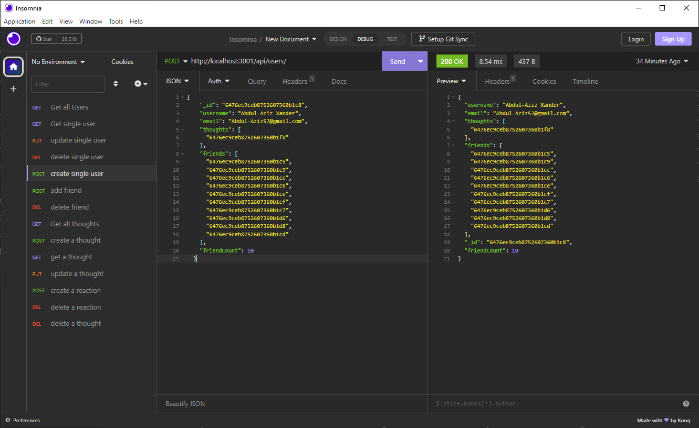

# Social Network API

[Video Demo](https://drive.google.com/file/d/1xV4swTMPgiaycSNFzwjoDQtL7gE66U2m/view?usp=sharing) 

## Description

The Social Network API is an exercise in back-end development, focusing on a NoSQL database model built with MongoDB and Mongoose, and utilizing Express.js for routing. This project demonstrates proficiency in building and structuring a social network API capable of managing large amounts of unstructured data. The application allows for creating, reading, updating, and deleting users and thoughts, as well as adding and removing friends and reactions. This challenge has been a great opportunity for me as a developer, reinforcing the principles of NoSQL databases, learning how to implement Mongoose ODM, and improving my skills in routing with Express.js. Completing this task has not only augmented my abilities in these areas but has also provided me with practical skills applicable to the development of social network applications.

## Table of Contents

- [Acceptance Criteria](#acceptance-criteria)
- [Installation](#installation)
- [Usage](#usage)
- [Technologies Used](#technologies-used)
- [Contributing](#contributing)
- [License](#license)
- [Links](#links)

## Acceptance Criteria

GIVEN a social network API
- WHEN I enter the command to invoke the application
- THEN my server is started and the Mongoose models are synced to the MongoDB database
- WHEN I open API GET routes in Insomnia for users and thoughts
- THEN the data for each of these routes is displayed in a formatted JSON
- WHEN I test API POST, PUT, and DELETE routes in Insomnia
- THEN I am able to successfully create, update, and delete users and thoughts in my database
- WHEN I test API POST and DELETE routes in Insomnia
- THEN I am able to successfully create and delete reactions to thoughts and add and remove friends to a user’s friend list

## Installation

To install this project on your local machine:

1. Clone the repository.
2. Navigate to the root directory of the repository in your terminal.
3. Run `npm install` to install the required dependencies.
4. Create a `.env` file and configure the environment variables.
5. Run `npm run seed` to seed the database with test data.

## Usage

Start the application by running `npm start` from the root directory in your terminal. Once the server is running, open Insomnia to interact with the API on `http://localhost:3001`.

## Technologies Used

- MongoDB
- Mongoose ODM
- Express.js
- Node.js

## Contributing

Contributions are welcome! To contribute:

1. Fork the repository.
2. Clone the repository to your local machine.
3. Create a new branch with your proposed changes.
4. Commit and push your changes to your forked repository.
5. Submit a pull request detailing your changes.

## License

This project is licensed under the MIT License - see the [LICENSE](./LICENSE) file for details. 

## Links
- [Repository](https://github.com/seantamturk/social-network-api)
- [Linkedin](https://www.linkedin.com/in/sean-tamturk-8253b722a/)

